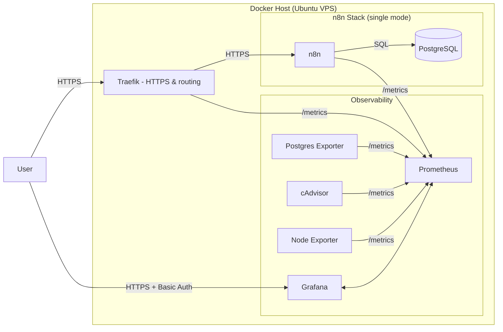
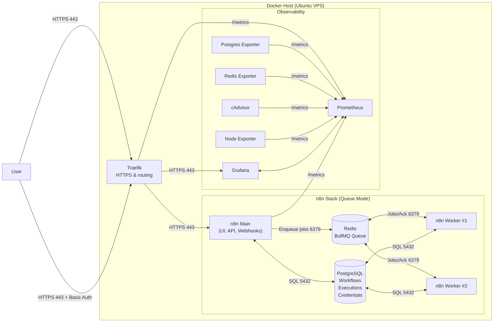
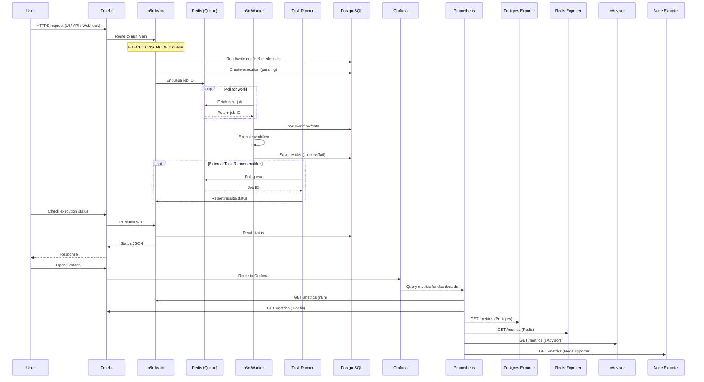

# n8n-observability

**n8n-observability** is a ready-to-use monitoring stack for n8n (queue mode) with production-grade metrics, dashboards, and alerts — built on **Prometheus**, **Grafana**, **Traefik**, and exporters for **PostgreSQL**, **Redis**, **Node**, and **containers**.

> **What you get**
>
> - **Reverse proxy & HTTPS:** Traefik (auto TLS via Let’s Encrypt)
> - **Data services:** PostgreSQL, Redis
> - **Metrics:** Prometheus, cAdvisor, Postgres/Redis exporters, Traefik & n8n metrics
> - **Dashboards & Alerts:** Grafana (pre-provisioned datasource & folders)
> - **n8n in queue mode:** `main` + `worker` + **external task runner**

---

## Table of Contents

1. [Architecture Overview](#architecture-overview)
2. [Task Processing Flow (Queue Mode)](#task-processing-flow-queue-mode)
3. [Prerequisites](#prerequisites)
4. [Folder Layout](#folder-layout)
5. [Generate Strong Secrets](#generate-strong-secrets)
6. [DNS Records](#dns-records)
7. [Traefik Basic Auth (dashboards)](#traefik-basic-auth-dashboards)
8. [Bring the Stack Up](#bring-the-stack-up)
9. [Health Checks & Sanity Testing](#health-checks--sanity-testing)
10. [Accessing Dashboards](#accessing-dashboards)
11. [Dashboards to Import](#dashboards-to-import)
12. [Alerts to Set Up](#alerts-to-set-up)
13. [Maintenance & Upgrades](#maintenance--upgrades)
14. [Backups](#backups)
15. [Security Tips](#security-tips)
16. [Troubleshooting](#troubleshooting)
17. [FAQ](#faq)
18. [Contributing](#contributing)
19. [License](#license)

---

## Architecture Overview

This deployment runs **n8n on Docker** with a secure edge, durable storage, and optional observability.

| Component | Purpose | Why it matters |
|---|---|---|
| **Traefik (HTTPS gateway)** | Terminates TLS (Let’s Encrypt), routes requests to services, applies Basic Auth to dashboards. | One entry point with automatic HTTPS and access control keeps the stack secure and simple to operate. |
| **n8n Main** | Serves the UI, API, webhooks, and schedules; enqueues jobs to Redis in queue mode. | Separates the control plane from execution so the app stays responsive under load. |
| **n8n Worker(s)** | Consume queued jobs from Redis and execute workflows. | Horizontal scaling: add workers to increase throughput without touching the UI/API. |
| **Task Runner (external)** | Runs long-lived or isolated tasks outside the main process. | Prevents heavy jobs from blocking the main app; improves stability and isolation. |
| **PostgreSQL** | Stores workflows, credentials, executions, and settings. | Durable, consistent system of record enables reliable restores and migrations. |
| **Redis (BullMQ)** | Acts as the message/queue backend for workflow executions. | Decouples ingestion from execution; smooths spikes and supports parallelism. |
| **Prometheus** | Scrapes metrics from n8n, Traefik, and exporters. | Foundation for alerting and capacity planning with a standard metrics model. |
| **Grafana** | Visualizes Prometheus data and manages alerts. | Fast troubleshooting and visibility with shared dashboards for the whole team. |
| **Exporters** *(Postgres, Redis, cAdvisor, Node Exporter)* | Expose service/host metrics in Prometheus format. | Deep operational insight: DB health, cache stats, container/host resources. |

### High-level view

A user connects over HTTPS to Traefik, which routes requests to n8n Main.
n8n stores data in PostgreSQL and pushes jobs to Redis; the Worker and Task Runner pull from Redis, process workflows, and write results back to Postgres.
Prometheus collects metrics from Traefik, n8n, and the exporters, and Grafana shows dashboards (behind Basic Auth).

**n8n Single Mode Observability Architecture**

**n8n Queue Mode Observability Architecture**

### Task Processing Flow (Queue Mode)

## Prerequisites

- A Linux server (Ubuntu 22.04+ or similar) with ports **80** and **443** open to the internet.
- **Docker** and **Docker Compose** installed.
  ```bash
  # Docker (Ubuntu example)
  curl -fsSL https://get.docker.com | sh
  sudo usermod -aG docker $USER
  newgrp docker

  # Compose plugin (on recent Docker this is already included)
  docker compose version
  ```
- A domain you control, e.g. `domain.com`.

---

## Folder Layout

Create the folders:

```bash
mkdir -p ~/n8n-observability/monitoring/grafana/provisioning/datasources
mkdir -p ~/n8n-observability/secrets
cd ~/n8n-observability

```

Your tree will look like:

```
n8n-observability/
├─ docker-compose.yml
├─ .env
├─ secrets/
│  └─ htpasswd
└─ monitoring/
   ├─ prometheus.yml
   └─ grafana/
      └─ provisioning/
         └─ datasources/
            └─ datasource.yml
```

---

### Generate strong secrets

```bash
# 16 random bytes, base64 (for STRONG_PASSWORD / RUNNERS_AUTH_TOKEN)
openssl rand -base64 16

# 32 random bytes, base64 (for N8N_ENCRYPTION_KEY)
openssl rand -base64 32
```

---

## DNS Records

Create **A/AAAA** records pointing to your server IP:

- `n8n.${DOMAIN}`
- `grafana.${DOMAIN}`
- `prometheus.${DOMAIN}` (optional; only if you plan to expose Prometheus UI)

---

## Traefik Basic Auth for Dashboards

Create a protected user for Grafana/Prometheus routes:

```bash
# Requires: apt install -y apache2-utils (or use docker httpd)
mkdir -p secrets
htpasswd -nbB admin 'YourSuperSecret' > ./secrets/htpasswd
```

> This file is mounted into Traefik and used by the Basic Auth middleware.

---

## Bring the Stack Up

```bash


docker compose pull          # fetch latest images

# Manual create volume
for v in n8n-data postgres-data redis-data letsencrypt; do docker volume create "$v"; done
docker volume ls | grep -E 'n8n-data|postgres-data|redis-data|letsencrypt'

# Start everything (Traefik, Postgres, Redis, n8n-main, 1 worker)
docker compose up -d

docker compose ps            # check containers are healthy
```

If a container restarts repeatedly, inspect logs:

```bash
docker compose logs -f traefik prometheus grafana postgres-exporter redis-exporter cadvisor n8n-main n8n-worker
```
---

## Health Checks & Sanity Testing

### Checking Logs After Deployment

After deploying, it's important to check service logs to confirm everything is healthy, catch early errors, and debug issues.

#### If you’re inside the compose project directory (recommended):

**Merged, live stream of all services in the stack:**

```bash
docker compose logs -f --tail=200
```
- `-f` follows the log stream in real-time.
- `--tail=200` shows the last 200 lines per service.
- Add `--since=10m` to limit to recent logs, `--no-color` for dumping to a file.

#### From anywhere (explicit paths):

```bash
docker compose \
  --project-directory /home/n8n \
  -f /home/n8n/docker-compose.yml \
  --env-file /home/n8n/.env \
  logs -f --tail=200
```
- Useful for scripts or when your compose files are in custom locations.

#### All Docker containers on the host

**One-shot (no follow), grouped by container:**

```bash
docker ps -q | xargs -I{} sh -c 'echo "===== {} ====="; docker logs --tail=200 {}'
```

**Live stream for every running container, merged with name prefix:**

```bash
for c in $(docker ps -q); do
  n=$(docker inspect -f '{{.Name}}' "$c" | sed 's#^/##')
  docker logs -f --tail=0 "$c" | sed "s/^/[$n] /" &
done; wait
```
- This will prefix each line with the container name, making merged logs easier to read.

#### With your toolkit

If you use a wrapper (e.g., `compose()` in your toolkit after sourcing `common.sh` and setting `N8N_DIR`/`ENV_FILE`/`COMPOSE_FILE`):

```bash
compose logs -f --tail=200
```

---

Check logs for errors, restarts, or warnings—especially in `n8n-main`, `n8n-worker`, and critical infrastructure (`traefik`, `postgres`, `redis`, `grafana`).  
If you see repeated restarts or errors, consult the troubleshooting section below.

---

### Quick CLI checks
```bash
# n8n metrics reachable from Prometheus network?
docker compose exec prometheus wget -qO- http://n8n-main:5678/metrics | head

# Traefik metrics reachable?
docker compose exec prometheus wget -qO- http://traefik:8081/metrics | head

# Prometheus targets count (should be >= the jobs you configured)
docker compose exec prometheus wget -qO- http://prometheus:9090/api/v1/targets | jq '.data.activeTargets | length'

```

### Prometheus UI (optional)
Open `https://prometheus.${DOMAIN}` → **Status → Targets**. All targets should be **UP**:
- `n8n-main:5678`, `traefik:8081`, `postgres-exporter:9187`, `redis-exporter:9121`, `cadvisor:8080`

### n8n health
- `n8n-main` has `/healthz` and `/healthz/readiness` internally (Traefik routes your public traffic to the app).

> In **queue mode**, the **worker** does not expose `/metrics`—scrape the **main** service.

---

## Accessing Dashboards

- **Grafana**: `https://grafana.${DOMAIN}`  
  - First prompt: **Traefik basic auth** (user/password from secrets/htpasswd).
  - Then Grafana login: admin / ${GRAFANA_ADMIN_PASSWORD}.
- **Prometheus** (optional): `https://prometheus.${DOMAIN}`  
  - Disabled by default (set EXPOSE_PROMETHEUS=true to expose; still behind Basic Auth)
---

## Dashboards to Import

In Grafana, go to **Dashboards → Import**, search by ID or paste JSON.

**Recommended dashboards:**

| Service          | Dashboard Name                | Grafana Dashboard ID | Link |
|------------------|------------------------------|----------------------|------|
| **n8n**          | n8n Queue Mode (Full)        | *(see JSON under dashboard directory)*    |      |
| **Traefik**      | Traefik v2 Metrics           | 12250                | [Traefik 2.x Dashboard](https://grafana.com/grafana/dashboards/12250) |
| **PostgreSQL**   | PostgreSQL Database          | 9628                 | [Postgres Exporter Dashboard](https://grafana.com/grafana/dashboards/9628) |
| **Redis**        | Redis Dashboard for Prometheus| 763                  | [Redis Dashboard](https://grafana.com/grafana/dashboards/763) |
| **Node Exporter**| Node Exporter Full           | 1860                 | [Node Exporter Full](https://grafana.com/grafana/dashboards/1860) |
| **cAdvisor**     | cAdvisor Exporter Dashboard  | 14282                | [cAdvisor Dashboard](https://grafana.com/grafana/dashboards/14282) |

**How to import:**
1. Go to Grafana → Dashboards → Import.
2. Enter the Dashboard ID from the table above.
3. Select your Prometheus datasource.
4. Click Import.

---

## Alerts to Set Up

Use **Grafana Alerting** (recommended) or Prometheus rules. Example queries:

- **n8n execution failures (rate over 5m)**
  ```promql
  rate(n8n_execution_failed_total[5m]) > 0
  ```

- **Queue backlog (BullMQ waiting)**
  ```promql
  max(n8n_queue_bull_queue_waiting) > 100
  ```

- **Traefik 5xx error rate > 1%**
  ```promql
  sum(rate(traefik_service_requests_total{code=~"5.."}[5m]))
  / sum(rate(traefik_service_requests_total[5m])) > 0.01
  ```

- **Redis evictions > 0**
  ```promql
  rate(redis_evicted_keys_total[5m]) > 0
  ```

- **Postgres connections > 80% of max** (if exposed)
  ```promql
  sum(pg_stat_activity_count) / max(pg_settings_max_connections) > 0.8
  ```

> Start simple; refine thresholds as you observe normal behavior.

---

## Maintenance & Upgrades

- **Update images**:
  ```bash
  docker compose pull
  docker compose up -d
  ```
- **Rotate secrets**: change in `.env`, then `docker compose up -d`.
- **Scale workers**:
  ```bash
  docker compose up -d --scale n8n-worker=3
  ```

---

## Backups

Prioritize these volumes:
- `n8n-data` (n8n credentials/settings)
- `postgres-data` (workflow executions, etc.)
- `letsencrypt` (TLS certs)
- *(optional)* `grafana-data` (dashboards/users)

Example backup (basic tar of a Docker named volume on Linux):
```bash
# Stop services that write to the volume before backup for consistency
docker run --rm -v postgres-data:/data -v $PWD:/backup busybox \
  tar czf /backup/postgres-data_$(date +%F).tgz /data

docker run --rm -v n8n-data:/data -v $PWD:/backup busybox \
  tar czf /backup/n8n-data_$(date +%F).tgz /data

docker run --rm -v letsencrypt:/data -v $PWD:/backup busybox \
  tar czf /backup/letsencrypt_$(date +%F).tgz /data
```

---

## Security Tips

- Strong, unique passwords; rotate regularly.
- Keep Prometheus internal unless you need the UI (EXPOSE_PROMETHEUS=false).
- Limit access to Grafana/Prometheus with basic auth and IP allowlists if possible.
- Keep **Traefik dashboard disabled** on the public internet (you have `--api.dashboard=false`).
- Keep Docker, images, and the host OS up to date.
- Consider enabling **SSO** for Grafana if available in your environment.

---

## Troubleshooting

**Let’s Encrypt certificate isn’t issued**
- Ensure DNS records point to your server IP.
- Port **80/443** must be reachable.
- Check Traefik logs:
  ```bash
  docker compose logs -f traefik
  ```

**Grafana shows “No data”**
- Check Prometheus targets:
  - `https://prometheus.${DOMAIN}` → *Status → Targets*
- Check that `prometheus.yml` matches service names and ports.

**Redis exporter DOWN**
- Verify password matches `STRONG_PASSWORD` in `.env`.

**Postgres exporter DOWN**
- Ensure `DATA_SOURCE_NAME` matches your DB name/user/password.

**n8n main is up but workers idle**
- Check Redis connectivity (password/host).
- Ensure `EXECUTIONS_MODE=queue` and worker command has proper `--concurrency`.

---

## Contributing

Contributions, feedback, and new dashboard templates are welcome!  
- Open an issue or pull request.

---

## License

This repository is MIT licensed.  
Community dashboard JSONs are attributed to their respective authors (see links in the table above).
